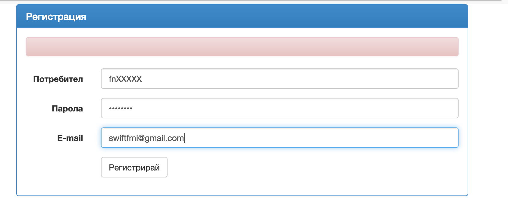

## Първото задание за самостоятелна домашна работа

Решениятo на всяка задача ще трябва да качите в нашия портал на следния адрес - [http://swiftfmi.apposestudio.com/](http://swiftfmi.apposestudio.com/register)

Всеки __ТРЯБВА__ да се регистрира с факултетния си номер.



За всяка задача, ще имате определена страница, където ще може да видите колко точки получавате.


Трябва да свалите шаблона и да попълните решението в него. Не оставяйте ненужни `print` извиквания във вашето решение. Системата няма да може да оцени некоректни решения и ще покаже съответната икона.


Ако имате някакви въпроси за системата, моля пишете на имейла за контакт.

Крайният срок за качване на решенията е _11.04.2022_!


## Задачи:

1. Повечето компютри разполагат с операционна система. А тя от своя страна поддържа файлова система и операции над файлове. В тази задача,
ще имате даден спиисък от пълни (абсолютни) пътища на файлове и директории (директориите са вид файл, който съдържа други файлове) във файлова система. Ето и няколко примера:
`/` 
`/games`
`/games/socoban`
`/games/socoban/socoban.app`

Напишете функция `countFolders`, която да отпечатва броя на всички директории. Следните правила ще са в сила за входните данни.

1. `/` - е основната папка (в нашата файлова система). Всеки път започва със `/`.
1. Всеки път до папка може да завършва на `/`
1. Всеки път без разширение се смята за папка.
1. Всеки път до файл завършва с разширение примерно `.conf` или `.app`. 
1. Пътища с разширение се считат за папки, само ако има други папки или файлове в тях. 
1. Всички междинни пътища ще съществуват в списъка с пътища, но не е гарантирано, че ще са подредени.

Пример:

За входните данни от горе отговорът ще 1 (`/`) + 1 (`/games`) + 1 (`/games/socoban`) = 3

За следните входни данни: 

`/`
`/g.a.m.e.s/socoban.folder` 
`/g.a.m.e.s/`

Отговорът ще 2. Пояснение: `socoban.folder` е файл с разширение `.folder`, не е папка.

    func countFolders(paths: [String]) -> Int {
        return -1
	}

2. Да се нaпише функция, която пресмята стойността на прост математически израз от вида по-долу, подаден като `String` препоръчва се използването на рекурсия:
	
	__Скобите ще са винаги налични и изразът ще е коректен!__

    > Рекусривното решение лесно може да постои двоично дърво от израза и да го пресметне, понеже са позволени само бинарни операции.
    > Ще се приемат всякакви решения.
	
	Пример: 
		
		((23 + 6) * 2)
	
	Възможните операции са ```^(степенуване), *, /,  +, - ```.
	
		func evaluate(expression: String) -> Double {
			//TODO: your implementation goes here
		}

3. Да се напише функция, която намира броят на различните пътища в лабиринт, зададен в двумерен масив (матрица). Ако няма път, да връща ```0```.

	_Препоръчително е да се използват помощни функции и структури._
 
	Пример: 
		
		^ 0 0 0 0 0 0 1
		0 1 1 1 1 1 0 0
		0 0 0 0 0 1 # 1
		0 1 1 1 0 1 0 0
		0 1 0 1 0 0 0 1
		0 0 0 1 0 1 0 *

```swift
    var testMaze = [
        ["^", "0", "0", "0", "0", "0", "0", "1"],
		["0", "1", "1", "1", "1", "1", "0", "0"],
		["0", "0", "0", "0", "0", "1", "#", "1"],
		["0", "1", "1", "1", "0", "1", "0", "0"],
		["0", "1", "0", "1", "0", "0", "0", "1"],
		["0", "0", "0", "1", "0", "1", "0", "*"]]
```
        
    Извикването на функцията, трябва да връща: 
    
           1

	Където:
	
		0 е проходимо поле
		1 е непроходимо поле
		^ е началната позиция
		* е крайната позиция
        # е непроходимо поле


	Примeрна функция:
                
            protocol Maze {
                init(raw: [[String]])
                ...
            }
            
            func findPaths(maze: [[String]]) -> Int {
			//TODO: your implementation goes here
		}

