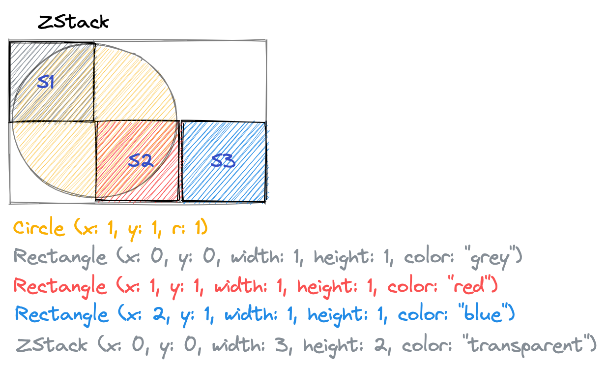

## Второ задание за самостоятелна домашна работа

Решениятo на всяка задача ще трябва да качите в нашия портал на следния адрес - [http://swiftfmi.apposestudio.com/](http://swiftfmi.apposestudio.com/register)

Всеки __ТРЯБВА__ да се регистрира с факултетния си номер.


За всяка задача, ще имате определена страница, където ще може да видите колко точки получавате.


Трябва да свалите шаблона и да попълните решението в него. Не оставяйте ненужни `print` извиквания във вашето решение. Системата няма да може да оцени некоректни решения и ще покаже съответната икона.


Ако имате някакви въпроси за системата, моля пишете на имейла за контакт.

Крайният срок за качване на решенията е _03.05.2022_!


## Задачи:

Дадени са следните протоколи (интерфейси):

`Fillable`

```swift
    protocol Fillable {
        var color: String { set, get }
    }
```

`VisualComponent`

```swift

    protocol VisualComponent: Fillable {
        //минимално покриващ правоъгълник
         var boundingBox: Rect { get }
         var parent: VisualComponent? { get }
        func draw()
    }
```
`VisualGroup`

```swift
    protocol VisualGroup: VisualComponent {
        //броят деца
         var numChildren: Int { get }
         //списък от всички деца
        var children: [VisualComponent] { get }
        //добавяне на дете
        func add(child: VisualComponent)
        //премахване на дете
        func remove(child: VisualComponent)
        //премахване на дете от съответния индекс - 0 базиран
        func removeChild(at: Int)
    }
```
и следните помощни структури

```swift    
    struct Point {
        var x: Double
        var y: Double
    }
    
    struct Rect {
        //top-left
        var top:Point
        var width: Double
        var height: Double
        
        init(x: Double, y: Double, width: Double, height: Double) {
            top = Point(x: x, y: y)
            self.width = width
            self.height = height
        }
    }
```
1. Да се имплементират следните класове (или структури, _по избор_):
    * `Triangle: VisualComponent `
        * коструктор `Trinagle(a: Point, b: Point, c: Point, color: String)`
    * `Rectangle: VisualComponent `
        * коструктор `Rectangle(x: Int, y: Int, width: Int, height: Int, color: String)`         
    * `Circle: VisualComponent `
        *  конструктор `Circle(x: Int, y:Int, r: Double, color: String)`
    *  `Path: VisualComponent `
        *  конструктор `Path(points: [Point], color: String)`
    * `HStack: VisualGroup`
        *  конструктор `HStack()`
        *  подрежда всички "деца" едно до другобез отстояние. Подравнене от горе. От лява на дясно.
        
    * `VStack: VisaulGroup`
        *  конструктор `VStack()`
        *  подрежда всички "деца" едно под друго без отстояние. Ляво подравнени. От горе на доло.
        
    * `ZStack: VisaulGroup`
        *  конструктор `ZStack()`
        *  подрежда всички "деца" едно над друго по координатите спрямо горен ляв ъгъл.
        

* Функцията `draw` да отпечатва текстова репрезентация на съответната фигура. Тази функция
няма да се използва при оценяването, но може да ви е полезна.

2. Да се имплементира функция, която определя дълбочината на йерархия от `VisualComponent`
	`func depth(root: VisualComponent?) -> Int`
	
	Пример:
	
		Ако	
		root = 
			HStack
				ZStack
					Circle
					VStack 
						Square
						Circle
				Circle
				Circle
		тогава
		depth(root: roоt) трябва да се оцени до 4
3. Да се имплемнтира функция, която определя броят елементите от даден "цвят" в йерархия от `VisualComponent`. 
	`func count(root: VisualComponent?, color: String) -> Int`
	
	Пример:
	
		Ако	
		c = Cicle
		root = 
			HStack (red)
				VStack
					Circle (red)
                    ZStack
                        Square
                        Circle (red)
				Circle (green)
				Circle (blue)
		тогава
		count(root: roоt, color: "red") трябва да се оцени до 3

4.  Да се напише функция, която намира най-малкия покриващ правоъгълник на `VisualComponent`.

        `func cover(root: VisualComponent?) -> Rect`
        
        Пример:
        
            Ако    
            root = 
                HStack
                    VStack
                        Circle (x:0, y:0, r:1)
                        Circle (x:0, y:0, r:1)
            тогава
            cover(root: roоt) трябва да оцени до Rect(x: 0, y: 0, width: 2, height: 4)


## Въпроси за системата за автоматично оценяване

1. Защо нямам оценка?
     
     > Вероятно кода, който сте предали не е .swift файл или самият той не може да се компилира. Възможно е да крашва и при подбраните от нас входни данни.
     
     Как да се справя с проблема?
     
     >Моля, пишете ни, ако не успявате да се справите с проблема.
     
2. Трябва ли решението да отпечатва нещо?

    > Решението **не** трябва да отпечатва нищо в конзолата, защото няма да може да бъде обработено от системата за автоматично оценяване. 
    
3. Ако нямам оценка, това 0 точки ли означава?

    > **Не**. Когато системата не е успяла да Ви оцени, трябва да разгледаме решението Ви отделно.
    
4. Може ли да добавите примерен файл, който работи при качване в системата.
    
    > Да. В задачите има връзка към такъв.

5. Имам проблеми със ситемата, но не намирам логично обяснение. Какво да правя?
    
    > Пишете ни. Екипът работи над подобрение на текущата системата. 
    
6. А кой е e-mail-a?

    > Трябва да го знаете вече.

7. Не трява ли задачите да са по-ясно дефинирани и да имаме повече примери, с които да тестваме. Системата не ме оценява правилно, а аз съм сигурен, че решението ми е супер вярно. Какво да правя?

> Условията на задачите не са формални, за да позволят интерпретация. Ние смятаме, че свободата в интерпретацията ви подготвя по-добре за реалните задачи след този курс. Не получавате оценкта в системата, защото пропускате случаи от решението (често това са крайни случаи, но валидни) или защото сте намерили проблем в системата (по-малко вероятно, но възможно). Моля, свържете се с нас, за да ви помогнем с насоки. 
